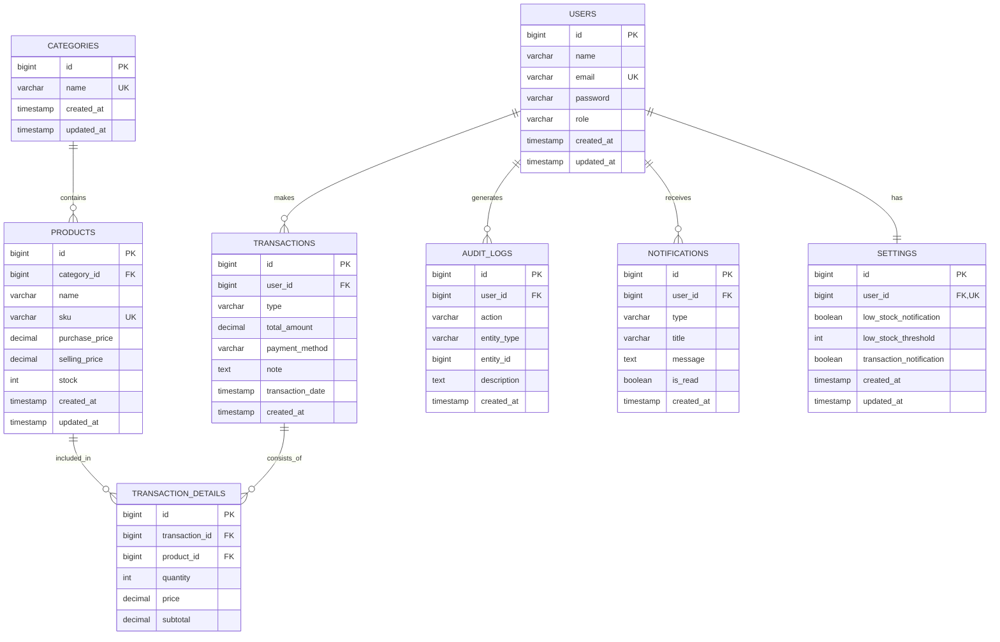

# Wayrung ER Diagram

Dokumentasi Entity Relationship Diagram (ERD) untuk sistem Wayrung.

```mermaid
erDiagram
    USERS {
        bigint id PK
        varchar name
        varchar email UK
        varchar password
        varchar role
        timestamp created_at
        timestamp updated_at
    }

    CATEGORIES {
        bigint id PK
        varchar name UK
        timestamp created_at
        timestamp updated_at
    }

    PRODUCTS {
        bigint id PK
        bigint category_id FK
        varchar name
        varchar sku UK
        decimal purchase_price
        decimal selling_price
        int stock
        timestamp created_at
        timestamp updated_at
    }

    TRANSACTIONS {
        bigint id PK
        bigint user_id FK
        varchar type
        decimal total_amount
        varchar payment_method
        text note
        timestamp transaction_date
        timestamp created_at
    }

    TRANSACTION_DETAILS {
        bigint id PK
        bigint transaction_id FK
        bigint product_id FK
        int quantity
        decimal price
        decimal subtotal
    }

    AUDIT_LOGS {
        bigint id PK
        bigint user_id FK
        varchar action
        varchar entity_type
        bigint entity_id
        text description
        timestamp created_at
    }

    NOTIFICATIONS {
        bigint id PK
        bigint user_id FK
        varchar type
        varchar title
        text message
        boolean is_read
        timestamp created_at
    }

    SETTINGS {
        bigint id PK
        bigint user_id FK,UK
        boolean low_stock_notification
        int low_stock_threshold
        boolean transaction_notification
        timestamp created_at
        timestamp updated_at
    }

    USERS ||--o{ TRANSACTIONS : "makes"
    USERS ||--o{ AUDIT_LOGS : "generates"
    USERS ||--o{ NOTIFICATIONS : "receives"
    USERS ||--|| SETTINGS : "has"
    CATEGORIES ||--o{ PRODUCTS : "contains"
    PRODUCTS ||--o{ TRANSACTION_DETAILS : "included_in"
    TRANSACTIONS ||--o{ TRANSACTION_DETAILS : "consists_of"
```
